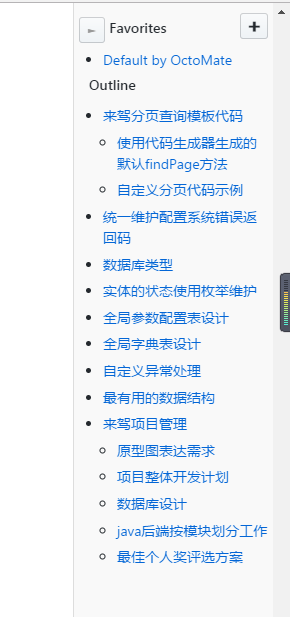
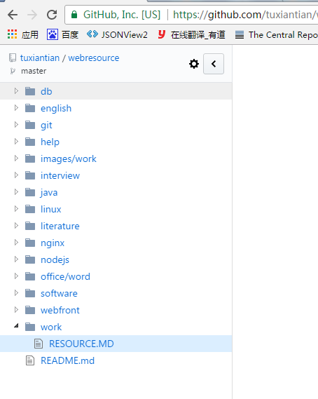

# webresource

useful website collections

## 使用频次最高的帮助链接

[bird](http://bird.so/)[bing](http://cn.bing.com) 

[登陆微信公众平台](https://mp.weixin.qq.com/)

[罗辑思维](http://www.ljsw.cc/)

[JavaTop100热门问答\(Stackoverflow\)](https://juejin.im/entry/5937585d0ce46300574154cb)

[对应的github地址](https://github.com/giantray/stackoverflow-java-top-qa)

[掘金](https://juejin.im/timeline)

[importnew](http://www.importnew.com/)

[查找开发人员所需的教程、工具和社区](https://www.ibm.com/developerworks/cn/)

[bootstrap](http://www.bootcss.com/)

[6TB视频\(iOS，Java，c++更新版\)](http://mp.weixin.qq.com/s/9nH6ORoE07MYMDMaq_BUaw)

[45个Git经典操作场景，专治不会合代码](https://mp.weixin.qq.com/s/8lhyBCnvOst2iKy-UFUo3Q)

[linux命令搜索](http://wangchujiang.com/linux-command/c/crontab.html)
[导出数据库表结构到文档中](https://gitee.com/pomz/database-export)

adminlte

* [官网示例](https://almsaeedstudio.com/themes/AdminLTE/documentation/index.html#)
* [参考文档](http://11140372.blog.51cto.com/)

### chrome上最好用的github网站的工具

OctoMate
> MissingmateofGitHub,makingsinglefiledownloadeffortlessandwithmorefeatures

Octotree

> CodetreeforGitHub

### 关于浏览器上面图片显示不清晰的办法

在浏览器上面查看图片，如看不清楚可以克隆下仓库到本地，本地查看的图片会更加清晰。

